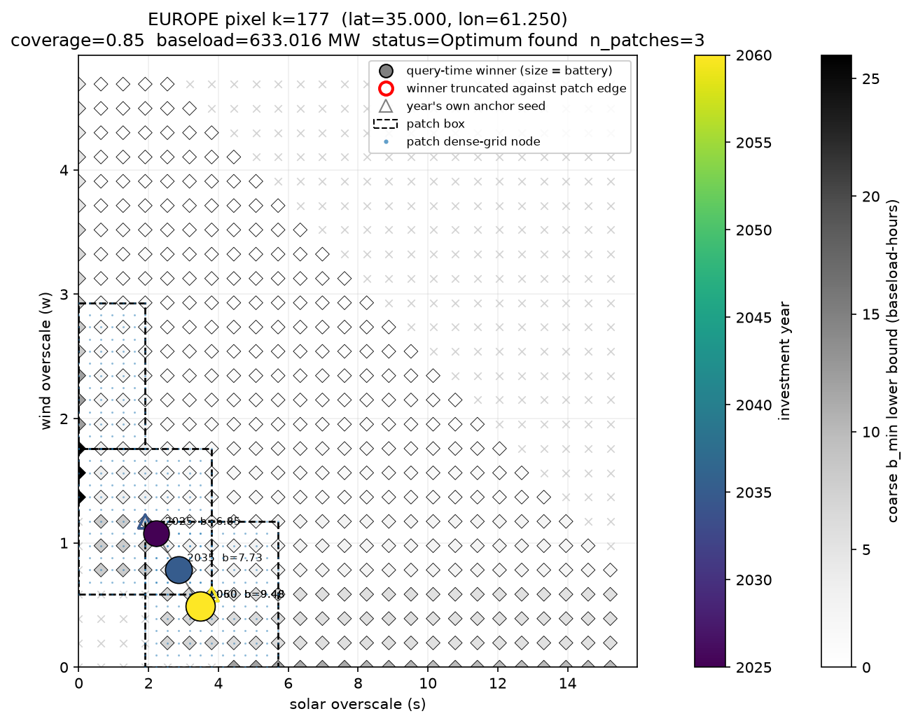

# Bisection search: methodology

Reference for the search implemented in `model/bisection.py`: the per-pixel algorithm, its
objective function, its parameters, and its output diagnostics. For what happens to the
result before and after this search, see the module docstrings in `model/frontier_cache.py`
and `model/global_extension.py`.

**Problem statement.** For each land pixel, find the solar/wind/battery mix that meets a
given hourly coverage target against that pixel's weather history at minimum LCOE, computed
once and repriceable under any investment year (2025-2060) or cost scenario without
resimulating dispatch.

**Units.** A design is three dimensionless **overscale** factors against a demand normalised
to 1: solar and wind as multiples of baseload MW, battery in baseload-hours. Every
`CostCoefficients` scalar scales linearly with baseload demand, so LCOE is exactly
baseload-invariant: one search, built once per pixel, serves every investment year and cost
scenario unchanged. `--load-density` sets the absolute MW figure at query time only
(`global_extension.py`), never the search itself.

## Objective function

```
LCOE(s, w, b) = (a_s*s + a_w*w + a_b*b**GAMMA) / (d0 * served_fraction)
```

| Term | Definition |
|---|---|
| `s`, `w` | Solar, wind overscale factors |
| `b` | Battery size, in baseload-hours |
| `a_s`, `a_w`, `a_b`, `d0` | The four scalars one `(year, cost-key)` combination's prices collapse to. Type `CostCoefficients` (`bisection.py:227`); computed by `cost_calculations.lcoe_coefficients`. |
| `GAMMA` | `1.0 + BATTERY_UNIT_CAPEX_SCALING_FACTOR` (`bisection.py:42`). Exponent on battery size: battery unit cost falls as installed hours grow (`(hours/AVERAGE_IMPLIED_STORAGE)**kappa`, `kappa < 0`), and combining that with quantity gives a single power law, sub-linear in `b`. |

`bisection.py` does not read a cost, a year, or a capacity ceiling directly. Costs enter only
through `argmin_lcoe` (query time); the land-availability ceiling is a separate module,
`boa.model.capacity_box`, not yet enforced at query time (see [Known
limitation](#known-limitation)).

## Algorithm: `build_pixel_frontier`

`build_pixel_frontier` (`bisection.py:1092`) runs per pixel, independent of cost or
investment year, in four stages:

1. **Coarse grid** (`coarse_b_min_grid`, `bisection.py:775`). Sweeps a `coarse_grid ×
   coarse_grid` grid over the feasible `(solar, wind)` box and computes, at each node, a
   lower bound on `b_min` (the smallest feasible battery) — not the converged value. Two
   reductions keep this cheap: only every `coarse_stride`-th node is solved exactly (`b_min`
   is non-increasing in both axes, so unsolved nodes inherit a bound from a dominating node),
   and each solved node runs only `coarse_bisect_steps` bisection steps. This bound feeds the
   seed ranking (stage 2) and the query-time containment certificate; it is never returned as
   an answer.

2. **Seed selection** (`anchor_score`, `bisection.py:847`; `select_seeds`, `bisection.py:871`).
   Scores each coarse cell under one or more frozen anchor cost-coefficient sets, then keeps
   the cheapest cell plus any near-ties (within `seed_tolerance`) that sit in a distinct basin
   (at least `min_separation` apart, Chebyshev distance). The objective is non-convex: a
   solar-heavy and a wind-heavy design can score within a few percent of each other while
   sitting far apart in `(s, w)`. The figure below shows one pixel that produces three
   separate patches under this rule.

3. **Patch refinement** (inside `build_pixel_frontier`). Builds a dense sub-grid around each
   seed. At every node, `b_min_at` (`bisection.py:560`) runs a full bisection to
   `tol_rel_patch` tolerance for the converged `b_min`. If a seed lands on the outer ring of
   the box, the box doubles (up to `max_box_widenings`) and stages 1-2 rerun.

4. **Battery ladder** (`rung_spans`, `bisection.py:606`; `battery_rungs`, `bisection.py:631`).
   At each patch node, evaluates a small ladder of battery sizes above `b_min`. `LCOE(b)` is
   not monotone once divided by served fraction, so the minimum-cost battery does not always
   coincide with the coverage minimum.

**Output.** `PixelFrontier` (`bisection.py:666`) stores dispatch physics only — coordinates,
battery sizes, served/covered fractions — with no cost, year, or capacity ceiling. One
frontier cache therefore serves every investment year and cost scenario; costs are used only
in stage 2, to decide where to place patches, never to determine what a patch contains.

## Query time: `argmin_lcoe`

`argmin_lcoe` (`bisection.py:1358`) takes a built `PixelFrontier` and one year's
`CostCoefficients` and returns the minimum-LCOE `Optimum` over every stored patch node and
rung, by direct evaluation of the closed-form objective above — no dispatch, no bisection.

It also returns two diagnostics:

| Diagnostic | Source | Meaning |
|---|---|---|
| `patch_certified` | `_containment_certificate`, `bisection.py:1336` | `True` if every coarse cell outside every patch is provably no cheaper than the reported optimum, using the coarse bound from stage 1 and `served_fraction <= 1`. |
| `argmin_truncated` | `_argmin_truncated`, `bisection.py:1313` | `True` if the winner sits against a patch-imposed edge, as opposed to a genuine corner solution (`s=0` or `w=0`) or the search box's own outer ring (already covered by `box_widenings`). |

When the certificate does not fire, `check_repair_budget` (`bisection.py:1416`) bounds the
share of a run that may fall back to an on-the-fly full patch rebuild before the run fails.

## Parameters

`SearchParams` (`bisection.py:77`) holds every search-quality knob. The full field set is
hashed into the frontier cache path, so a changed value forks a new cache. None of these
fields is a physical parameter (see `docs/model-assumptions.md` for those): a wrong value
here costs precision or build time, never feasibility, since hourly coverage is enforced at
every node regardless of these settings. Field comments in `SearchParams` give current
defaults and the measurements behind them; several are marked provisional pending a
global-coverage sweep.

| Group | Fields |
|---|---|
| Search box | `box_multiple`, `box_min`, `box_abs_max`, `max_box_widenings`, `corner_cut_threshold` |
| Anchor coverage | `anchor_tol`, `max_anchors` |
| Coarse tier resolution | `coarse_grid`, `coarse_stride`, `coarse_bisect_steps` |
| Patch tier resolution and seeding | `patch_grid`, `patch_halfwidth`, `lattice_refinement`, `seed_tolerance`, `max_seeds`, `max_patch_slots` |
| Battery ladder | `ladder_rungs`, `ladder_max_span` |
| Bisection tolerance | `b_cap`, `tol_rel_patch`, `repair_rate_cap` |

## Status codes

Source of truth: `STATUS_CODES` in `config/constants.py`. Codes are year-invariant by
construction — they depend only on profiles, the coverage target, and (for code 6) the search
box, never on cost — which lets `lcoe_promotion` require `status` to match across every
investment year in a run.

| Code | Meaning |
|---|---|
| 0 | Not modelled (sentinel) |
| 1 | OK |
| 2 | No optimum found |
| 3 | Zero potential |
| 4 | Retired — was the Monte Carlo minimum-survivor cut; must never be reused |
| 5 | Unallocated |
| 6 | Reserved — capacity-box screen ("Grid 2"), not yet implemented |

## Known limitation

The capacity ceiling (land-availability constraint, "Grid 2") is built but not yet enforced
at query time: every query reports the unconstrained optimum regardless of `--load-density`.
See `docs/running-the-model.md` for the operational detail.

## Figure



One pixel from a built frontier cache (`cds-2023-lulc+excl` weather, `default` costs,
`coverage=0.85`), queried at four investment years (2025, 2035, 2050, 2060). Grey diamonds
are the coarse `b_min` lower-bound grid (light x's mark infeasible cells); dashed boxes are
the three patches this pixel's seed selection produced, each with its own dense grid of blue
dots. The coloured trajectory marks `argmin_lcoe`'s winner at each year, sized by battery: the
optimum moves from a smaller, more solar-heavy design in 2025 to a larger, cheaper-battery
design by 2050, after which the cost workbook's capex trajectory is flat, so 2050 and 2060
coincide. Hollow triangles mark where each year's cost ratio alone would place a seed, for
comparison against the patch the full multi-anchor build actually produced.
